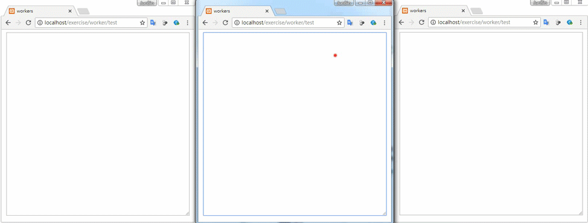

# SharedWorker 
>使用SharedWorker API 同步更新所有網頁
## 執行結果

---
## 檔案目錄
|檔案名稱|功能|
|---|---|
|index.html|首頁|
|main.js|處理workers|
|db.php|連接資料庫|
|create.php|新增資料|
|update.php|更新資料|
|search.php|判斷資料是否存在|
|getValue.php|取得資料|
|.htaccess|覆寫規則|

---

## 資料表規劃(workers)
w_id = primary key

w_content = 內容

## ※注意
> URL的/後必須要有1~10字元，這個程式是以這個路由參數做為資料表的key，所以相同的路由參數會抓相同的資料，達到同步資料的結果。
## 舉例來說
localhost/worker/`test` 是使用key為`test`的資料

localhost/worker/`abc` 是使用key為`abc`的資料

這兩個網址使用相同的程式，但是資料的來源不同，顯示的就是不同的資料。